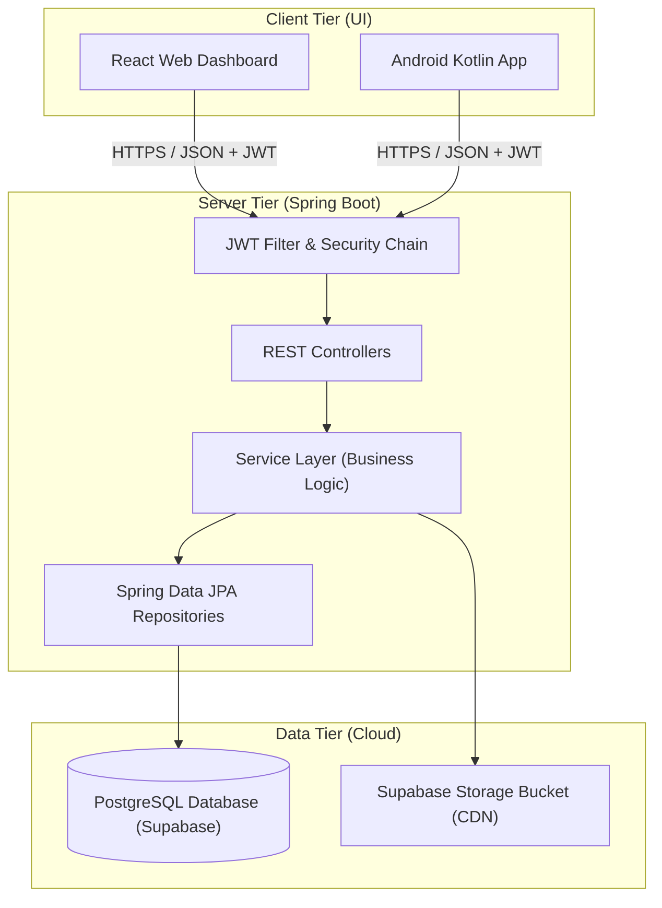

# SariTrack 🛒 
> **Your Store, Digitalized. A Premium Multi-Tenant SaaS POS Ecosystem.**


SariTrack is a high-performance, multi-tenant platform designed to modernize the traditional sari-sari store ecosystem. By bridging the gap between manual paper ledger ("listahan") systems and modern digital retail, SariTrack empowers small-scale store owners with professional management tools across Web and Mobile.

---

## 🏗️ System Architecture

SariTrack is organized as a **Three-Tier Architecture** coupled with a **Vertical Slice** module design for clean maintainability:



1.  **`backend/`**: A high-availability Java Spring Boot 3 API managing RBAC security, atomic transactions, multi-tenant database isolation, and 3rd-party integrations.
2.  **`web/`**: A premium React management dashboard for vendors to perform bulk inventory management, review analytics, track outstanding debt profiles, and generate reports.
3.  **`mobile/`**: A high-speed Android POS application optimized for real-time barcode scanning (ML Kit), cart actions, offline caching, and on-the-floor credit settlement.

---

## ✨ Core Features

### 🏪 For Vendors (Store Owners)
*   **Inventory 2.0**: Barcode scanning, low-stock indicators, and product cataloging with secure **Supabase Cloud Image Storage**.
*   **Digital Credits ("Listahan")**: Debt tracking, chronological debtor timelines, and transaction settlement tools.
*   **Hybrid Checkout**: Atomic sales checkouts supporting **Cash**, **Store Debt**, or **Digital sandbox payments (PayMongo)**.
*   **Global Pricing**: Real-time currency conversions using live external rates.
*   **Audit-Ready Reports**: Instant downloads of professional **PDF Receipts and CSV spreadsheets**.

### 🛡️ For Administrators
*   **Global Vendor Monitoring**: High-level platform metrics, active store lists, and product audits.
*   **Robust Security**: Spring Security token filters, secure BCrypt hashing, Google OAuth2 account pickers, and strict database multi-tenancy boundaries.

---

## 📋 System Prerequisites

Ensure you have the following installed on your development machine before launching:
*   **Java JDK 17** (or newer)
*   **Node.js v18.x** (or newer) & npm
*   **Android Studio Koala** (or newer) & Android SDK (targeting API Level 34+)
*   **ngrok** (or similar tunneling utility, required for physical mobile testing and sandbox webhooks)

---

## ⚙️ Setup & Configuration

### 1. Database Setup (Supabase)
SariTrack uses PostgreSQL. You can spin up a free instance on [Supabase](https://supabase.com):
1. Create a project and retrieve the **JDBC Connection URL**, **Database Username**, and **Password**.
2. Create an **Image Storage Bucket** named `products` and set its policies to public read.

### 2. Environment Variables Configuration

#### Backend Configuration (`backend/src/main/resources/application.properties`)
Create or edit your variables. The project uses a hybrid config mapping properties to environment keys with safe default fallbacks:
```properties
# Supabase/PostgreSQL database credentials
spring.datasource.url=jdbc:postgresql://[YOUR_SUPABASE_HOST]:6543/postgres?sslmode=require&prepareThreshold=0
spring.datasource.username=[YOUR_DB_USERNAME]
spring.datasource.password=[YOUR_DB_PASSWORD]

# PayMongo Sandbox Credentials
paymongo.secret.key=${PAYMONGO_SECRET_KEY:[YOUR_PAYMONGO_TEST_SECRET_KEY]}
paymongo.webhook.secret=${PAYMONGO_WEBHOOK_SECRET:[YOUR_PAYMONGO_TEST_WEBHOOK_SECRET]}

# Google OAuth2 Credentials
spring.security.oauth2.client.registration.google.client-id=[YOUR_GOOGLE_CLIENT_ID]
spring.security.oauth2.client.registration.google.client-secret=[YOUR_GOOGLE_CLIENT_SECRET]

# SMTP Email Configuration (For gmail, generate an "App Password")
spring.mail.username=[YOUR_GMAIL_ADDRESS]
spring.mail.password=[YOUR_GMAIL_APP_PASSWORD]
```

#### Web Configuration (`web/.env`)
Create a `.env` file in the `web/` directory:
```env
VITE_API_URL=http://localhost:8080
VITE_SUPABASE_URL=https://[YOUR_PROJECT_REF].supabase.co
VITE_SUPABASE_ANON_KEY=[YOUR_SUPABASE_ANON_KEY]
```

---

## 🚀 Step-by-Step Running Guide

Always launch the services in this exact order:

### Step 1: Start the Spring Boot Backend 🟢
```bash
cd backend
./mvnw spring-boot:run
```
*The API is now running locally at `http://localhost:8080`*

### Step 2: Establish the Network Tunnel (ngrok) 🌀
*Required if testing on a physical phone or receiving PayMongo callbacks.*
```bash
ngrok http 8080
```
Copy the secure HTTPS URL generated (e.g., `https://xxxx-xx.ngrok-free.dev`).

### Step 3: Run the React Web Dashboard 🌐
1. Install dependencies:
   ```bash
   cd web
   npm install
   ```
2. Start the development server:
   ```bash
   npm run dev
   ```
*The web portal will open at `http://localhost:5173`*

### Step 4: Configure and Run the Android App 📱
1. Open the `/mobile` folder in Android Studio.
2. Open `app/src/main/java/edu/cit/tapales/saritrack/core/api/RetrofitClient.kt`.
3. Locate the `BASE_URL` property:
   *   **Using Android Emulator (Same PC):** Point to `http://10.0.2.2:8080/` (special loopback alias).
   *   **Using Physical Device on Same Wi-Fi:** Point to your PC's local IP (e.g., `http://192.168.1.XX:8080/`).
   *   **Using ngrok (Cellular data / external networks):** Paste the ngrok tunnel URL (e.g., `https://xxxx-xx.ngrok-free.dev/`).
4. Click **Build & Run** (Shift + F10) on Android Studio.

---

## ⚡ Offline Capability & Testing

SariTrack is equipped with a premium, resilient offline-first UX layer on Android. You can test these offline features directly on your mobile device:

1.  **Test Auto-Login Bypass:** 
    Log in once while connected to the internet. Close the app, turn off all Wi-Fi and mobile data on your phone, and open the app again. The app will detect your secure token in `EncryptedSharedPreferences` and **boot you straight to the Dashboard instantly** with zero connectivity lag.
2.  **Test Offline Image Caching:**
    Navigate to the "Products" grid while offline. Thanks to the integrated **Glide Disk Cache Strategy**, all product images will render beautifully from your phone's storage.
3.  **Test Offline Reports & Charts:**
    Open the "Home" page while offline. Instead of going blank, the application will deserialize your last saved dashboard analytics from **GSON-SharedPreferences**, drawing the line charts and list metrics offline, and displaying: *"Viewing offline cached dashboard stats"*.

---

## 📁 Repository Map

```text
IT342-Tapales-SariTrack/
├── backend/            # Spring Boot REST API
├── web/                # ReactJS Web Portal
├── mobile/             # Kotlin / XML Android App
├── docs/               # System architecture and regression reports
│   ├── SDD_REVISED_SariTrack.md
│   ├── REGRESSION_TEST_REPORT.md
│   ├── MOBILE_DEV_PLAN.md
│   └── WEB_DEV_PLAN.md
└── README.md           # Getting started and setup specs (this file)
```

---

## 📝 Course Context & Author

*   **Course:** IT342 - System Integration and Architecture (3rd Year, 2nd Semester)
*   **Project Title:** SariTrack
*   **Student Author:** Christian Kyle Bayarcal Tapales
