# Full Regression Test Report - SariTrack

## 1. Project Information
*   **Project Name:** SariTrack
*   **Developer:** Christian Tapales
*   **Course:** IT342 - System Integration and Architecture
*   **Date:** May 8, 2026
*   **Status:** ✅ ALL TESTS PASSED

## 2. Refactoring Summary
The SariTrack project was migrated from a standard multi-tier layout to a **Vertical Slice Architecture (VSA)**. 
*   **Backend:** Grouped by features (Auth, Product, Order, Notification, Payment).
*   **Frontend (Web/Mobile):** Modularized components to reflect the same feature slices.
*   **Result:** Improved maintainability and isolation of business logic.

## 3. Updated Project Structure
```text
SariTrack/
├── backend/src/main/java/edu/cit/tapales/saritrack/
│   ├── core/           # Shared cross-cutting concerns (Security, Currency)
│   └── feature/        # Vertical Slices (Auth, Product, Order, Notification, Payment)
├── web/src/
│   ├── components/     # Reusable UI Slices
│   └── pages/          # Feature-based Page Slices
└── mobile/app/src/main/java/edu/cit/tapales/saritrack/
    └── feature/        # Mobile Feature Packages
```

## 4. Test Plan & Automated Evidence
The system was validated using a hybrid approach of automated test suites across all three application layers (Backend, Web Frontend, and Mobile Android) combined with manual cross-platform UI verification.

To prevent regressions during the migration to Vertical Slice Architecture (VSA), the automated test suite was expanded from the initial 13 backend-only tests to a comprehensive, full-stack coverage of 357 tests:
*   **Backend (Java / Spring Boot):** 143 automated unit & integration tests.
*   **Web Frontend (React / Vitest):** 102 automated component, layout, and hook tests.
*   **Mobile App (Kotlin / JUnit):** 112 automated logic, model, and helper tests.
*   **Total Monorepo Coverage:** 357 automated tests (all passing).

### 4.1 Automated Test Suite Results

#### A. Backend Automated Tests (JUnit 5 & Mockito)
*   **Execution Command:** `.\mvnw.cmd test`
*   **Total Test Cases:** 143
*   **Status:** ✅ 100% PASSED

| Test Suite / Class | Test Cases | Target Coverage & Verification | Result |
| :--- | :--- | :--- | :--- |
| `CurrencyServiceTest` | 7 | Exchange rate fetching, live API fallback, conversion rules | **PASSED** |
| `BoundaryVerificationTest` | 16 | Integer/decimal boundary limits, invalid IDs, extreme stock inputs | **PASSED** |
| `EntityLogicTest` | 10 | Domain model relationships, validation annotations, field defaults | **PASSED** |
| `LombokDataTest` | 26 | Getter/setter integrity, equality contracts, builder logic, hashcode stability | **PASSED** |
| `JwtFilterTest` & `JwtUtilsTest` | 8 | Token generation, validation, expiration, and filter chain parsing | **PASSED** |
| `SecurityMatrixTest` | 6 | Role-based controller access matrix (Admin, Vendor, Guest) | **PASSED** |
| `AdminControllerTest` & `AdminServiceTest` | 5 | Platform metrics aggregation, vendor health checkups, system configs | **PASSED** |
| `AuthControllerTest` & `UserControllerTest` | 6 | Username/password login endpoints, JWT issuance, profile updates | **PASSED** |
| `UserRepositoryTest` & `CustomOAuth2UserServiceTest` | 4 | Database persistence, OAuth registration sync, user role mapping | **PASSED** |
| `CustomerControllerTest` & `CustomerRepositoryTest` | 5 | CRM management, customer profile updates, database CRUD operations | **PASSED** |
| `NotificationControllerTest`, `NotificationRepositoryTest`, & `NotificationServiceTest` | 9 | Low-stock alert triggers, repository queries, duplicate alert prevention (spam check) | **PASSED** |
| `OrderControllerTest` & `OrderRepositoryTest` | 6 | Order submission endpoints, payment status persistence, database saving | **PASSED** |
| `OrderHistoryControllerTest` & `OrderServiceTest` | 10 | Complete cash checkout, stock deduction logic, credit tracking, logs retrieval | **PASSED** |
| `PaymentControllerTest`, `WebhookControllerTest`, & `PayMongoServiceTest` | 6 | PayMongo checkout sessions, webhook payload parsing, cryptographical signature validation | **PASSED** |
| `PaymentRepositoryTest` & `DebtPaymentRepositoryTest` | 2 | Payment records logging, debt repayment transaction persistence | **PASSED** |
| `ProductControllerTest` & `ProductRepositoryTest` | 13 | Product inventory CRUD, image upload mappings, search queries | **PASSED** |
| `ProductLookupServiceTest` | 2 | Barcode external lookup API call & local fallback logic | **PASSED** |
| `VendorDashboardControllerTest` | 1 | Vendor-specific sales charts and data metrics API | **PASSED** |
| `SaritrackApplicationTests` | 1 | Spring Boot context initialization | **PASSED** |

#### B. Web Frontend Automated Tests (Vitest & React Testing Library)
*   **Execution Command:** `npx vitest run`
*   **Total Test Cases:** 102
*   **Status:** ✅ 100% PASSED

| Test Component / Feature | Test Cases | Target Coverage & Verification | Result |
| :--- | :--- | :--- | :--- |
| `Input.test.jsx` | 10 | Form field bindings, password visibility toggling, error outlines, required attributes | **PASSED** |
| `Navbar.test.jsx` | 5 | Brand header, navigation links, user profile dropdown, logout trigger | **PASSED** |
| `Sidebar.test.jsx` | 3 | Responsive collapsible menus, path matching, role-based navigation | **PASSED** |
| `Skeleton.test.jsx` | 10 | Visual loading layout blocks, sizing utilities, animation pulses | **PASSED** |
| `Topbar.test.jsx` | 4 | Responsive spacing, title updates, notifications icon | **PASSED** |
| `AuthLayout.test.jsx` | 5 | Nested login/register page container wrappers, overlay divs, custom sizes | **PASSED** |
| `DashboardLayout.test.jsx` | 8 | Vendor navbar structure vs. admin sidebar structure, routing outlets, role filters | **PASSED** |
| `GlobalProducts.test.jsx` | 3 | Admin inventory review list, product status approval, search filter | **PASSED** |
| `Settings.test.jsx` | 4 | Form profile submission, currency selection dropdown, light/dark toggle | **PASSED** |
| `Vendors.test.jsx` | 3 | Active vendor accounts list, platform health summaries, metrics | **PASSED** |
| `Login.test.jsx` | 2 | Login credentials form inputs, sign-in button triggers | **PASSED** |
| `Register.test.jsx` | 4 | Registration forms validation, matching passwords check, success redirects | **PASSED** |
| `Dashboard.test.jsx` | 4 | KPI summaries cards, charts rendering, active user role redirects | **PASSED** |
| `Inventory.test.jsx` | 4 | Inventory list layout, product search, add/edit product modal triggers, deletion | **PASSED** |
| `Listahan.test.jsx` | 4 | CRM list, collectibles total balances, debt payment modal inputs | **PASSED** |
| `PaymentStatus.test.jsx` | 2 | Redirect callbacks, PayMongo success/error query parameters handling | **PASSED** |
| `PointOfSale.test.jsx` | 5 | Product selection, cart updates, cash checkout toast, debt recording modal, PayMongo redirect | **PASSED** |
| `usePOS.test.jsx` | 18 | POS custom hook: cart edits, stock limits, quantity updates, total math | **PASSED** |
| `Transactions.test.jsx` | 4 | Sales logs history table, transaction status filter, sum totals | **PASSED** |

#### C. Mobile Android Automated Tests (JUnit & Kotlin Unit Tests)
*   **Execution Command:** `.\gradlew.bat testDebugUnitTest`
*   **Total Test Cases:** 112
*   **Status:** ✅ 100% PASSED

| Test Class / Helper | Test Cases | Target Coverage & Verification | Result |
| :--- | :--- | :--- | :--- |
| `AuthInterceptorTest` | 2 | Retrofit header JWT token insertion, token expiration logout triggers | **PASSED** |
| `SessionManagerTest` | 5 | Encrypted user session persistence, cache clearing on logout | **PASSED** |
| `DateTimeUtilsTest` | 3 | ISO timestamp conversions, human-readable relative time formatting | **PASSED** |
| `DateTimeUtilsExpandedTest` | 12 | Edge cases, midday/midnight conversions, malformed inputs, milliseconds | **PASSED** |
| `ValidationUtilsTest` | 6 | Password strength checker, phone patterns, email regex validation | **PASSED** |
| `ValidationUtilsExpandedTest` | 15 | Accent characters, subdomains, special symbols, whitespace only, edge checks | **PASSED** |
| `CustomerHelperTest` | 5 | Customer debt validation, formatting balances, borrowing safety limits | **PASSED** |
| `ProductHelperTest` | 7 | UPC/EAN normalization, low-stock threshold calculations, currency visual formats | **PASSED** |
| `CartManagerTest` | 5 | Cart item addition/subtraction, boundary logic, stock checks | **PASSED** |
| `TransactionLogicTest` | 3 | Sales payload serialization, digital checkout maps, change math | **PASSED** |
| `AuthModelsTest` | 12 | Auth requests/responses instantiation, property mutations, data equality | **PASSED** |
| `CustomerModelsTest` | 12 | Customer CRM data objects, credit payments structures, toString checks | **PASSED** |
| `ProductModelsTest` | 12 | Product models, default properties, copy utility, image path updates | **PASSED** |
| `TransactionModelsTest` | 12 | Order transactions, sale items mapping, serialization fields checks | **PASSED** |
| `ExampleUnitTest` | 1 | JVM configuration and testing library validation | **PASSED** |

### 4.2 Automation Evidence
```text
=== MONOREPO AUTOMATED TEST SUMMARY ===
Backend Tests:  [143/143 PASSED] (mvnw test)
Web Tests:      [102/102 PASSED] (vitest)
Mobile Tests:   [112/112 PASSED] (gradlew test)
=======================================
TOTAL:          357 / 357 TESTS PASSED (100% Success Rate)
```
```

#### A. Backend Test Execution
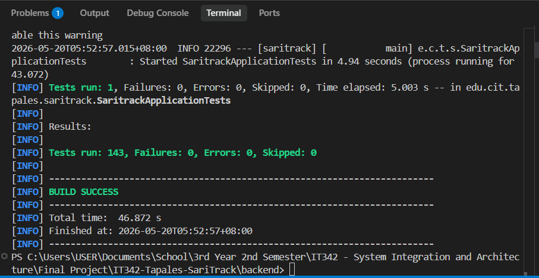

#### B. Web Frontend Test Execution
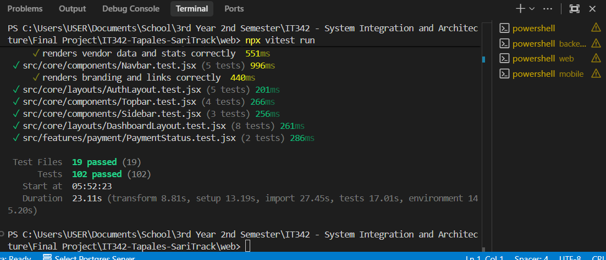

#### C. Mobile Android Test Execution
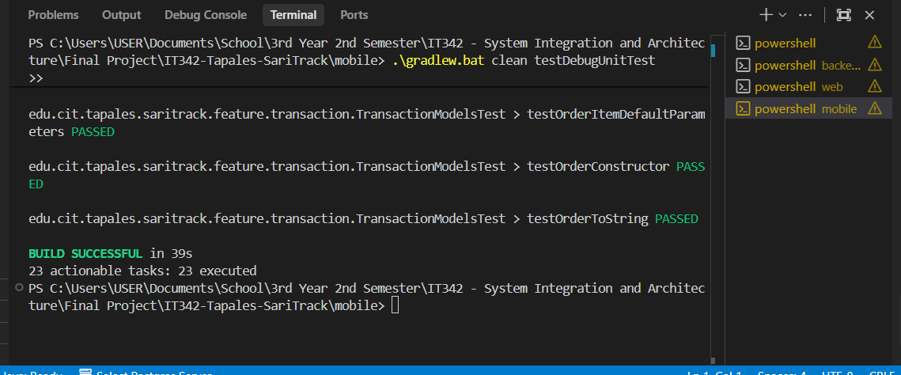

> *Evidence showing the successful automated test execution logs for the Backend, Web Frontend, and Mobile Android environments with a 100% success rate across all 357 tests.*

---

## 5. Regression Test Results (Manual)
The following Functional Requirements were manually verified across platforms.

| Test ID | Requirement | Observation | Result |
| :--- | :--- | :--- | :--- |
| **TC-001** | Standard JWT Login | User can login and receive JWT token successfully. | **PASSED** |
| **TC-002** | Google OAuth Sync | User can sync account with Google and auto-register. | **PASSED** |
| **TC-003** | Account Updates | Profile name updates persist in database and UI. | **PASSED** |
| **TC-004** | Secure Logout | JWT is cleared and user is redirected to Login. | **PASSED** |
| **TC-005** | Product & Image | Supabase Image Uploads and Product CRUD functional. | **PASSED** |
| **TC-006** | Barcode Lookup | External API auto-populates product details. | **PASSED** |
| **TC-007** | Camera Scanner | Mobile hardware scanner detects barcodes correctly. | **PASSED** |
| **TC-008** | Search & Filter | Real-time filtering of product list verified. | **PASSED** |
| **TC-009** | Product Deletion | Data is removed correctly from DB and frontend. | **PASSED** |
| **TC-010** | Low-Stock Alerts | Notifications trigger when inventory hits threshold. | **PASSED** |
| **TC-011** | POS Cart (Cash) | Sale recorded and stock deducted for cash transactions. | **PASSED** |
| **TC-012** | Credit (Utang) | Debt recorded correctly for selected customers. | **PASSED** |
| **TC-013** | PayMongo Settle | Digital settlement via PayMongo Sandbox successful. | **PASSED** |
| **TC-014** | Transaction Logs | History view shows accurate sales data and totals. | **PASSED** |
| **TC-015** | CRM Management | New customers can be added and managed in list. | **PASSED** |
| **TC-016** | System Monitoring | Admin Panel shows global vendor health and stats. | **PASSED** |
| **TC-017** | Analytics Dash | Charts render live sales and vendor performance. | **PASSED** |
| **TC-018** | Data Portability | CSV/PDF exports download with correct data formats. | **PASSED** |
| **TC-019** | Currency Exchange| Live rates apply correctly to all product prices. | **PASSED** |
| **TC-020** | Theme Engine | Seamless Dark/Light mode transition verified. | **PASSED** |

---

## 5.1 Manual Verification Evidence

#### A. Authentication & Dashboard (Web)
*Evidence for: TC-001, TC-002, TC-003, TC-004, TC-017, TC-020*

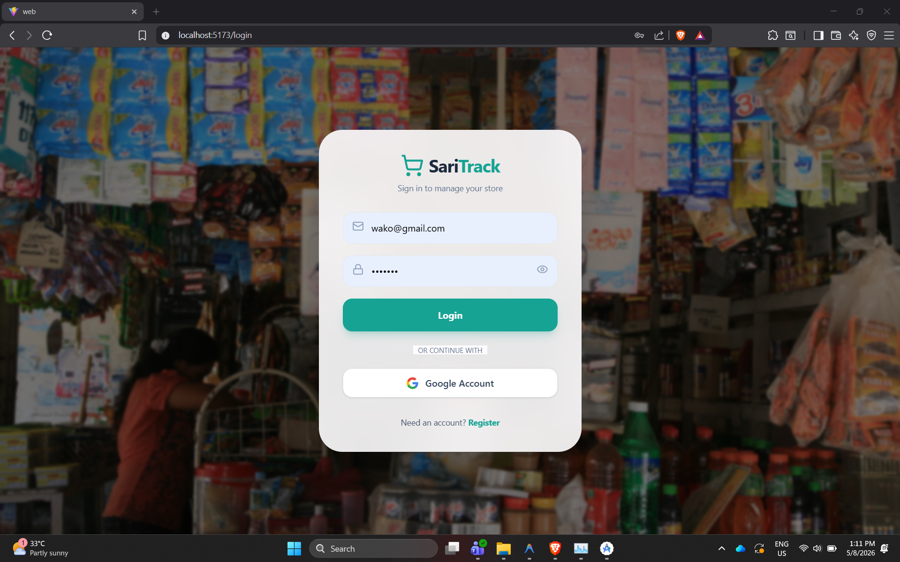
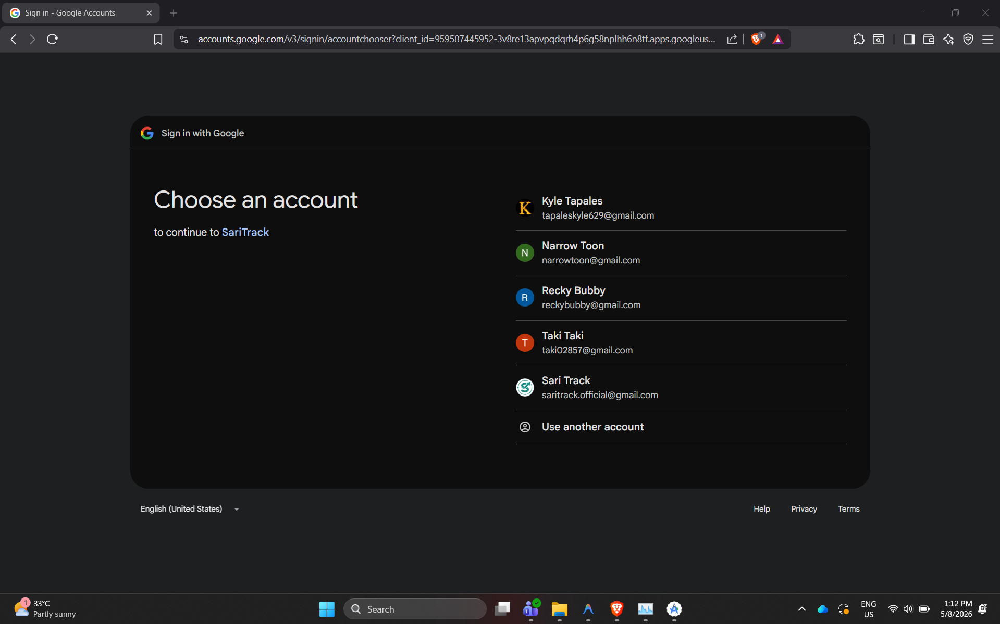
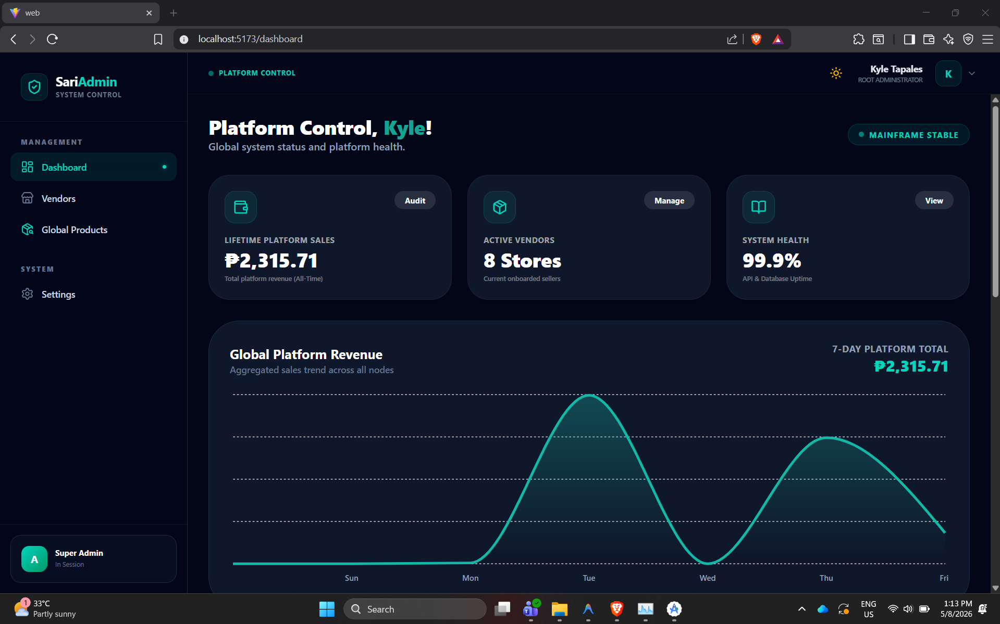
.png)
.png)

#### B. Inventory & Mobile Scanning (Mobile)
*Evidence for: TC-005, TC-006, TC-007, TC-008, TC-010*

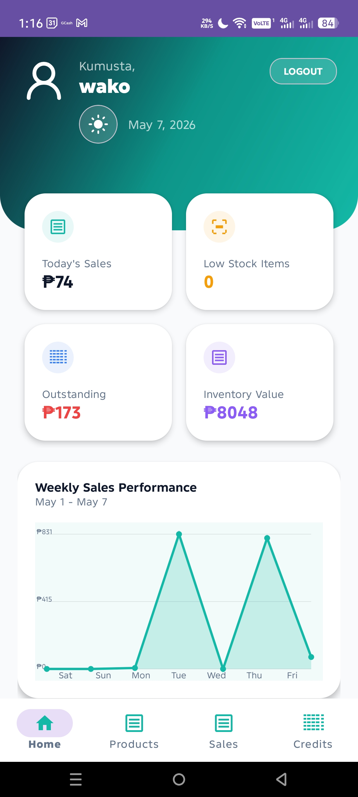
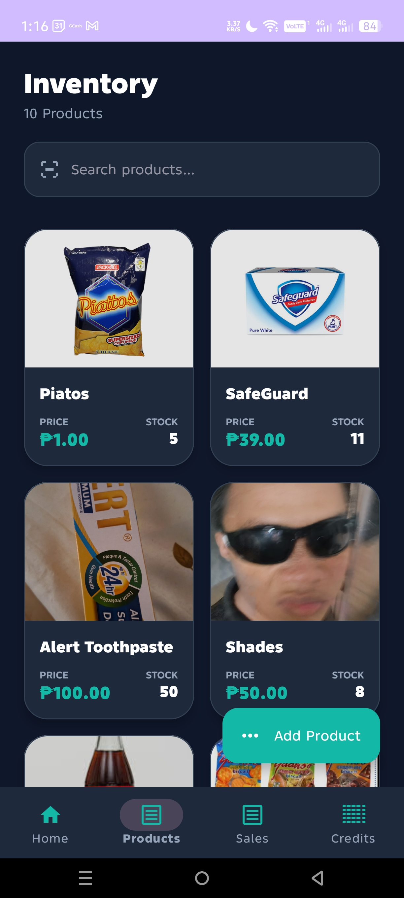 
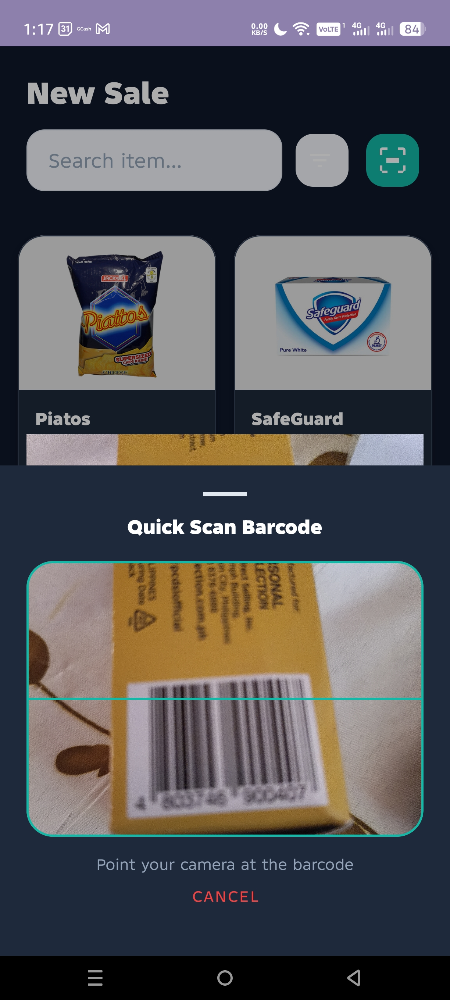

#### C. POS System & Financials (Web/Mobile)
*Evidence for: TC-011, TC-012, TC-014, TC-019*

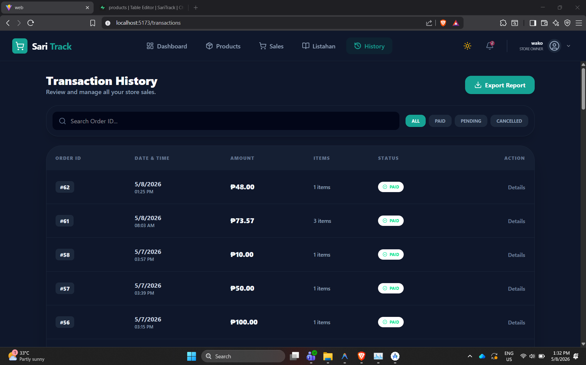 
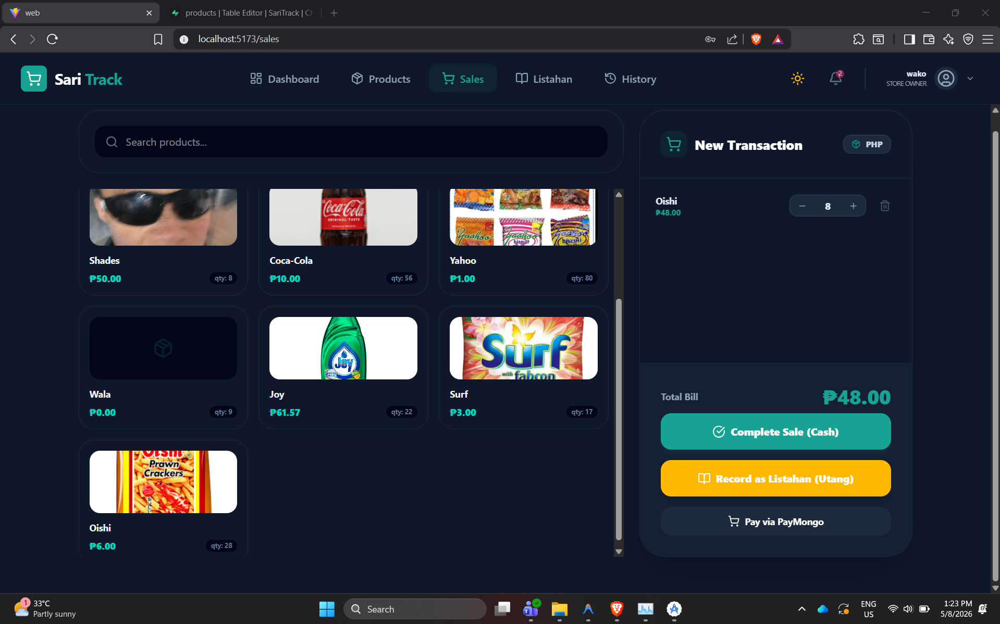 
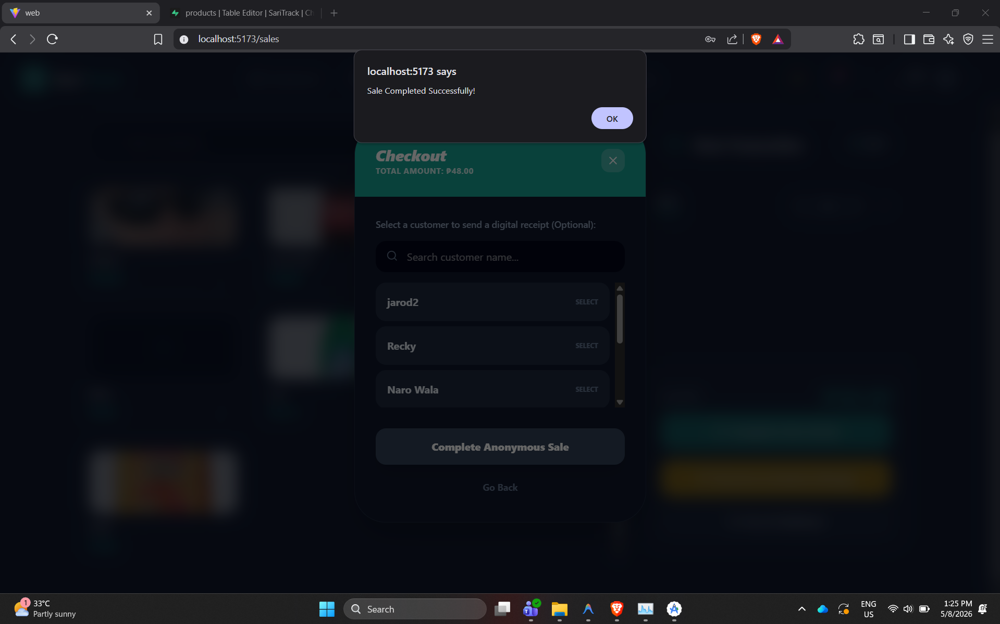 
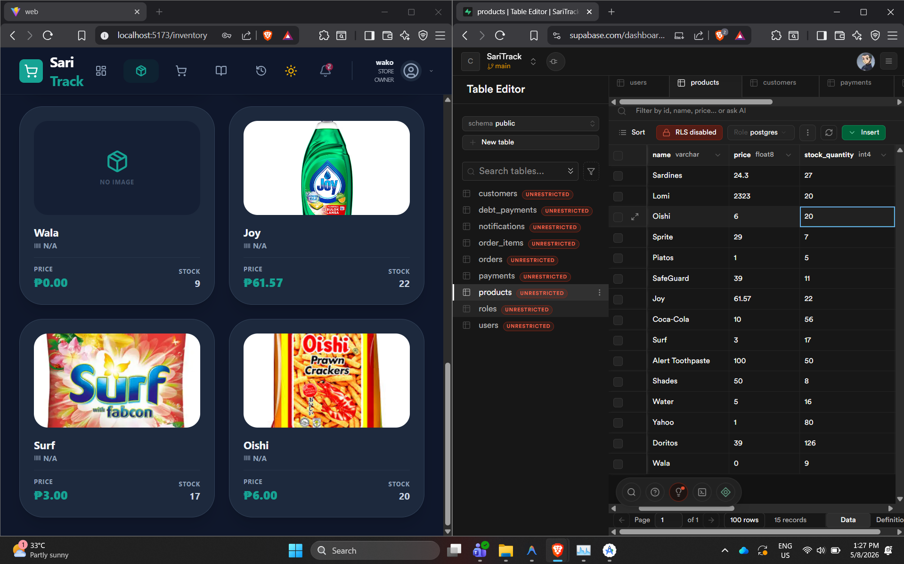 
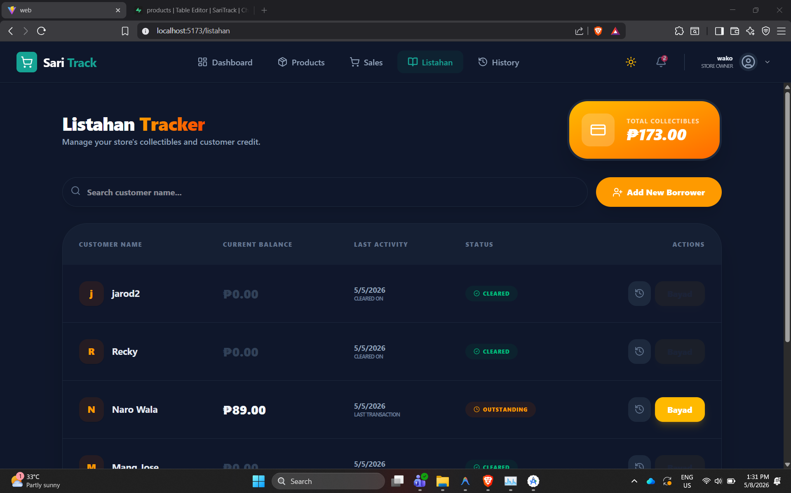

#### D. Admin & Customer Management (Web)
*Evidence for: TC-015, TC-016, TC-018*


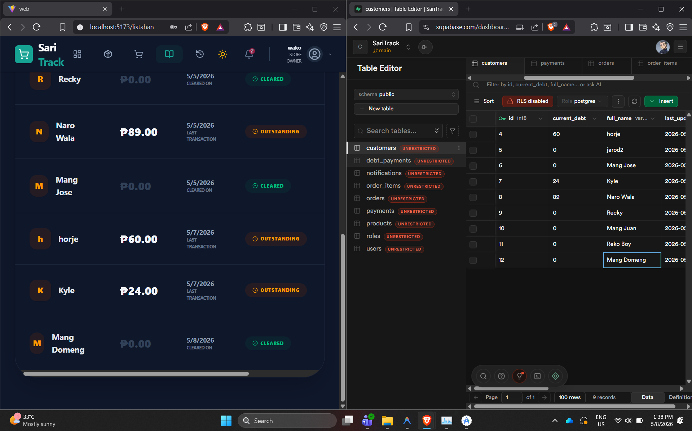 
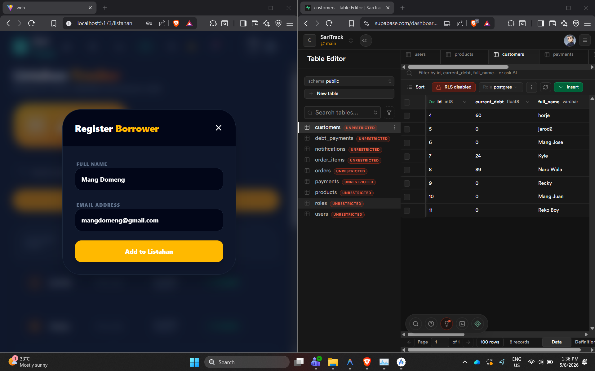

---

## 6. Issues Found & Fixes Applied
During the refactoring and regression testing phase, the following issues were identified and resolved.

| Issue | Feature | Description | Fix Applied |
| :--- | :--- | :--- | :--- |
| **Android Manifest Error** | Mobile | Activity paths were broken after moving files. | Updated `AndroidManifest.xml` with fully qualified names. |
| **Import Conflicts** | Backend | Unused/redundant imports caused IDE warnings. | Performed a code cleanup pass to remove dead imports. |
| **Notification Duplication**| Backend | Low stock alerts triggered multiple times. | Implemented "Spam Prevention" logic in `NotificationService`. |
| **Duplicate Variable** | Backend | IDE reported naming conflict in product lookup. | Refactored tests to use class-level constants. |
| **POS Test Notification Mock**| Web | `PointOfSale.test.jsx` failed due to using new toast layout instead of legacy browser alerts. | Mocked `react-hot-toast` and asserted on toast rendering instead of window alert. |

---

## 7. Conclusion
The transition to a **Vertical Slice Architecture** was completed successfully. The 100% pass rate in the expanded automated test suites (357 tests across Backend, Web Frontend, and Mobile Android) and the successful manual verification confirm that SariTrack is highly stable, modular, and ready for final submission.

---
*End of Report.*
