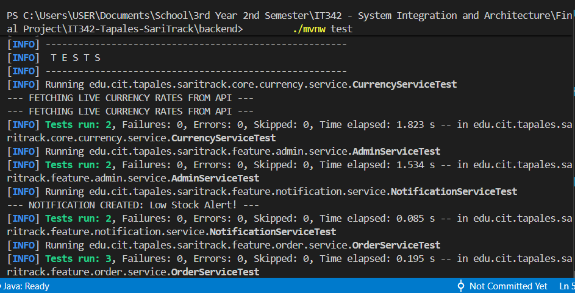
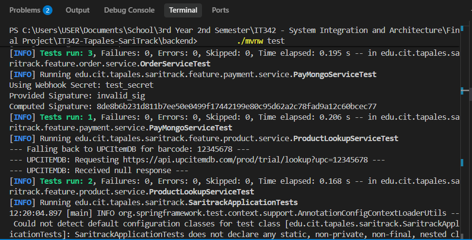
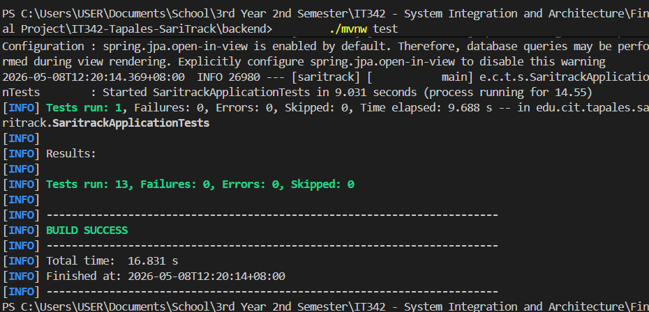
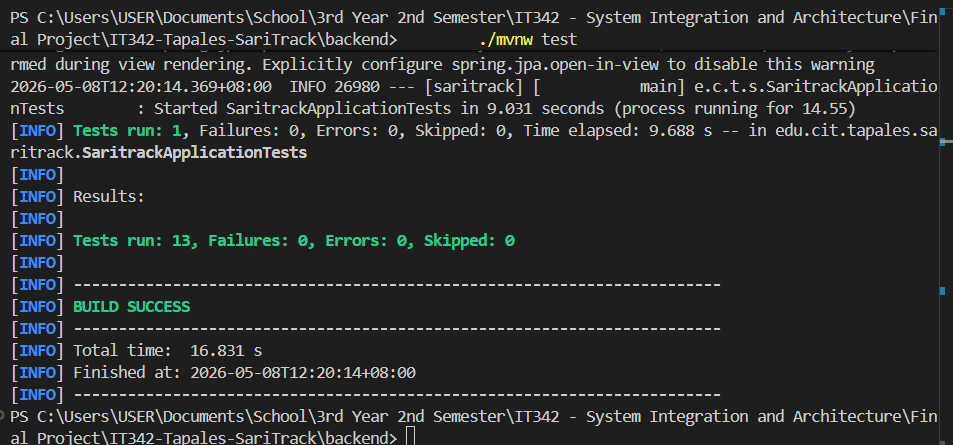

# SariTrack - Software Test Plan & Matrix

## 1. Project Information
*   **Project Name:** SariTrack
*   **Version:** 1.1 (Refactored)
*   **Architecture:** Vertical Slice Architecture (VSA)
*   **Lead Developer:** Christian Kyle Tapales
*   **Date:** May 8, 2026

## 2. Overview
This Software Test Plan defines the testing strategy, scenarios, and matrix for the SariTrack SaaS platform. The objective is to validate all Functional Requirements (FRs) outlined in the System Design Document (SDD) following the transition to a Vertical Slice Architecture.

## 3. Testing Strategy
* **Manual UI Testing:** Verify Web (React) and Mobile (Android) interactions, UI state, and user flows.
* **Automated Unit Testing:** Verify core backend business logic (Spring Boot) using JUnit & Mockito to ensure the refactoring did not introduce regressions.
* **Integration Testing:** Verify external APIs (Supabase Storage, PayMongo, ExchangeRates).

---

## 4. Test Case Matrix (Functional Requirements)

| Test ID | Module | Requirement Coverage | Description / Objective | Steps to Execute | Expected Result | Status |
| :--- | :--- | :--- | :--- | :--- | :--- | :--- |
| **TC-001** | Auth | User Authentication | Verify Standard JWT Login | 1. Navigate to `/login`   2. Enter email & password   3. Click Login | Redirects to Dashboard, JWT stored in localStorage | Pending |
| **TC-002** | Auth | External Auth Sync | Verify Google OAuth Sync | 1. Click "Google Account"   2. Authenticate via Google | Auto-creates user if new, issues JWT, redirects to Dashboard | Pending |
| **TC-003** | Inventory | Cloud File Storage | Verify Product Creation & Image Upload | 1. Go to Inventory   2. Fill details   3. Upload Image   4. Save | Image URL saved from Supabase, Product appears in list | Pending |
| **TC-004** | Inventory | External API Lookup | Verify External Barcode Lookup | 1. Enter known barcode   2. Wait for auto-lookup | Fields auto-populate via external API | Pending |
| **TC-005** | POS | Inventory Management | Verify Cart Checkout (Cash) | 1. Scan/Select item   2. Add to cart   3. Pay with Cash | Order recorded as "PAID", Product stock deducted | Pending |
| **TC-006** | POS | Credit Management | Verify Debt Recording (Utang) | 1. Add item to cart   2. Select Customer   3. Pay via Debt | Order recorded as "DEBT", Customer balance increased | Pending |
| **TC-007** | Payment | Digital Settlement | Verify Digital Settlement | 1. Go to Listahan   2. Click "Settle via PayMongo"   3. Complete Sandbox payment | Webhook fires, Payment status = "PAID", Customer debt reduced | Pending |
| **TC-008** | Reports | Real-time Analytics | Verify Analytics Dashboard | 1. Go to Dashboard | UI renders accurate Sales, Orders, and Top Selling items | Pending |
| **TC-009** | Reports | Data Portability | Verify Data Export (CSV/PDF) | 1. Click Export CSV/PDF | Browser downloads correctly formatted file | Pending |
| **TC-010** | Admin | System Monitoring | Verify Global Vendor Monitoring | 1. Access Admin Panel | Views global stats, registered vendors, and overall platform health | Pending |
| **TC-011** | Core | Currency Localization | Verify Real-time Exchange Rates | 1. Select USD/EUR in settings | Prices across POS and Inventory update based on live rates | Pending |
| **TC-012** | Inventory | Business Intelligence | Verify Low-Stock Alerts | 1. Set product stock to 1   2. Perform a sale | Dashboard shows "Low Stock" indicator and notification is sent | Pending |
| **TC-013** | Mobile | Hardware Integration | Verify Barcode Camera Scanner | 1. Open Scanner on Android   2. Point at a physical barcode | Camera overlay appears, barcode is detected, and data is sent to API | Pending |

---

## 5. Automated Test Implementation (Backend)
To provide robust regression evidence, automated tests have been implemented for critical path logic using JUnit and Mockito.

### 5.1 Test Suite Summary
| Test Class | Method | Targeted Logic | Status |
| :--- | :--- | :--- | :--- |
| `OrderServiceTest` | `testCompleteSale_DeductsStock` | Inventory stock deduction logic | **PASSED** |
| `OrderServiceTest` | `testCompleteSale_DebtRecords` | Customer debt/utang calculation | **PASSED** |
| `OrderServiceTest` | `testFinalizeDigitalOrder` | Digital payment stock handling | **PASSED** |
| `AdminServiceTest` | `testGetPlatformStats` | Global sales aggregation algorithms | **PASSED** |
| `AdminServiceTest` | `testVendorAnalyticsStatus` | Vendor performance tier logic | **PASSED** |
| `NotificationServiceTest` | `testSyncLowStock` | Automated low stock alert logic | **PASSED** |
| `NotificationServiceTest` | `testSpamPrevention` | Duplicate notification avoidance | **PASSED** |
| `CurrencyServiceTest` | `testPHPBaseRate` | Multi-currency base logic (PHP=1.0) | **PASSED** |
| `CurrencyServiceTest` | `testMajorCurrencies` | Currency data mapping verification | **PASSED** |
| `PayMongoServiceTest` | `testSignatureValidation` | Payment webhook cryptographic security | **PASSED** |
| `ProductLookupServiceTest` | `testLookupProductName` | External barcode API integration logic | **PASSED** |
| `SaritrackApplicationTests` | `contextLoads` | Spring Boot context initialization | **PASSED** |

## Screenshots of Automated Test Results

### 5.2 Automation Evidence
* **Tool:** Maven Surefire Plugin
* **Execution Date:** May 8, 2026
* **Result:** `Tests run: 13, Failures: 0, Errors: 0, Skipped: 0`

---
*Generated as part of Phase 3 Refactoring Requirements.*
